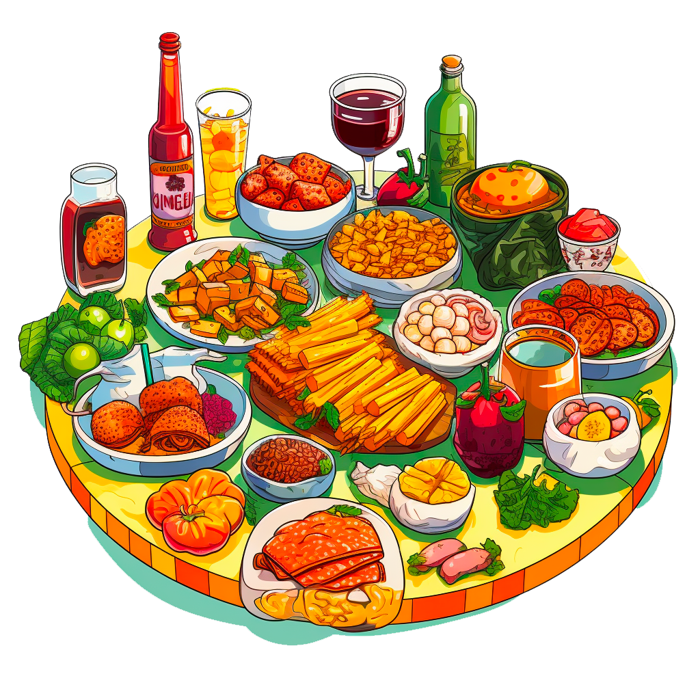

## Next Meals

Example project following the **Next.js 15 & React - The Complete Guide** based on [Maximilian Schwarzmüller's Udemy course](https://www.udemy.com/course/react-the-complete-guide-incl-redux).

## Next Meal Demo

- **Next.js 15 Core Features**

  - App Router with file-based routing
  - Server Components as default
  - Server Actions for form handling (meals sharing)
  - Dynamic Routes for meal details (`[mealSlug]`)
  - Static Metadata API for SEO
  - Loading UI and Error Boundaries
  - Not Found pages handling

- **React Hooks & Patterns**

  - `useActionState` for form submission states
  - `useFormStatus` for indicating form submission state
  - `useRef` for file input handling
  - `useState` for image preview
  - `useEffect` for image slideshow
  - `usePathname` for active link detection

- **Data & Image Handling**

  - SQLite database integration with `better-sqlite3`
  - Image optimization with `Next/Image` component
  - File upload handling for meal images
  - XSS protection with `xss` package
  - Slug generation with `slugify`

- **Styling & UI**

  - CSS Modules for scoped styling
  - Responsive design with media queries
  - Custom animations and transitions
  - SVG background with gradient
  - Google Fonts integration
  - Image slideshow component

## Screenshots

Meal Home

Meal Detail

Share Meal Page

